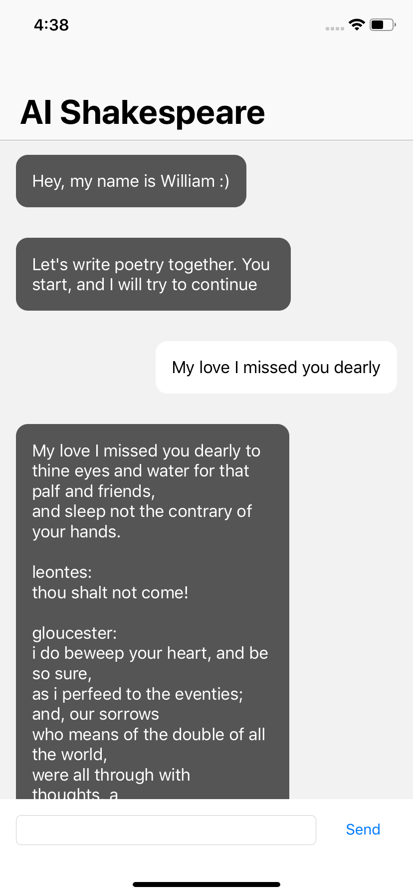

# Language modeling for mobile devices
### Introduction. 
It is a neural language model embedded into a mobile application.  
### Poetry generation. 
Essentialy it is a AI-bot, which generates shakespeare-style poetry given an input from the user  
### On-device. 
The model is built into mobile application, therefore it works offline and does not require an Internet connection.
### Inference. 
UPDATE: The inference time is 1.2 sec for 300 text characters.
### Model: Character-level model and char-embeddings. 
The model works on character-level and uses character embeddings derived from GloVe word embeddings to capture semantical meaning of the individual characters.
### Evaluation. 
The BPC (bits per character) metric on the test set is rather high since the model is really small (800k parameters), otherwise, it would not work on a mobile device. Still, it produces syntatically correct text and sometimes is rather coherent.  
UPDATE: The same model gives a good result on the Penn TreeBank dataset with BPC score of 1.42, which is not bad at all for this tiny model.
### Working. 
The project is in working condition as you can see from the screenshot. Code for this project is private.

